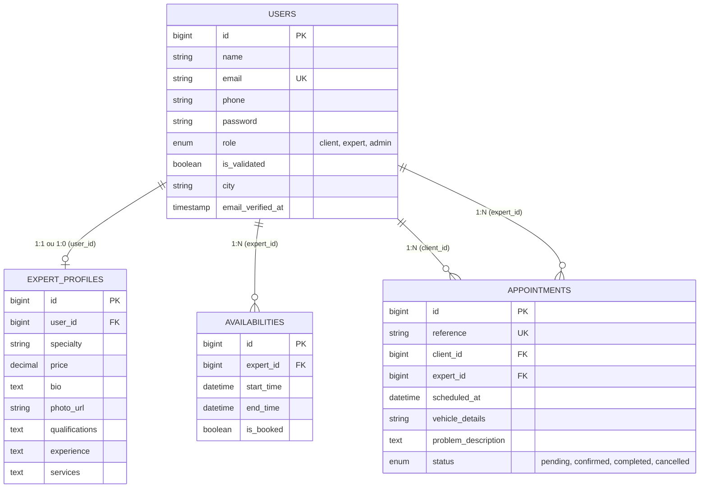

# Modèle Conceptuel de Données (MCD) et Modèle Logique de Données (MLD)

Ce document présente l'architecture de la base de données du projet "AutoExpertis".

## 1. Modèle Conceptuel de Données (MCD)

Le MCD représente les entités principales du système et leurs relations, indépendamment de toute implémentation technique.

### Entités et Attributs

*   **USER** (Utilisateur)
    *   `id` : Identifiant unique
    *   `name` : Nom complet
    *   `email` : Adresse email
    *   `phone` : Numéro de téléphone
    *   `password` : Mot de passe
    *   `role` : Rôle (client, expert, admin)
    *   `is_validated` : Statut de validation de l'expert
    *   `city` : Ville
    *   `email_verified_at` : Date de vérification email

*   **EXPERT_PROFILE** (Profil de l'expert)
    *   `id` : Identifiant unique du profil
    *   `specialty` : Spécialité
    *   `price` : Tarif d'intervention
    *   `bio` : Biographie / Description
    *   `photo_url` : URL de la photo de profil
    *   `qualifications` : Diplômes / Certifications
    *   `experience` : Années d'expérience
    *   `services` : Services proposés

*   **AVAILABILITY** (Disponibilité)
    *   `id` : Identifiant unique
    *   `start_time` : Heure de début
    *   `end_time` : Heure de fin
    *   `is_booked` : Statut de réservation (booléen)

*   **APPOINTMENT** (Rendez-vous)
    *   `id` : Identifiant unique
    *   `reference` : Référence unique du rendez-vous
    *   `scheduled_at` : Date et heure prévues
    *   `vehicle_details` : Informations sur le véhicule
    *   `problem_description` : Description du problème
    *   `status` : Statut (pending, confirmed, completed, cancelled)

### Relations

*   Un **USER** (Expert) *possède* `0,1` **EXPERT_PROFILE**. Un **EXPERT_PROFILE** *appartient à* `1,1` **USER**.
*   Un **USER** (Expert) *définit* `0,n` **AVAILABILITY**. Une **AVAILABILITY** *concerne* `1,1` **USER** (Expert).
*   Un **USER** (Client) *prend* `0,n` **APPOINTMENT**. L'**APPOINTMENT** *implique* `1,1` **USER** (Client).
*   Un **USER** (Expert) *reçoit* `0,n` **APPOINTMENT**. L'**APPOINTMENT** *est assigné à* `1,1` **USER** (Expert).

---

## 2. Modèle Logique de Données (MLD)

Le MLD traduit le modèle conceptuel en structure relationnelle avec des clés primaires (PK) et des clés étrangères (FK).

### Tables et Champs

```text
USERS
- id (PK) : BIGINT AUTO_INCREMENT
- name : VARCHAR
- email : VARCHAR UNIQUE
- phone : VARCHAR NULL
- email_verified_at : TIMESTAMP NULL
- password : VARCHAR
- role : ENUM ('client', 'expert', 'admin') DEFAULT 'client'
- is_validated : BOOLEAN DEFAULT FALSE
- city : VARCHAR NULL
- remember_token : VARCHAR NULL
- created_at : TIMESTAMP
- updated_at : TIMESTAMP

EXPERT_PROFILES
- id (PK) : BIGINT AUTO_INCREMENT
- user_id (FK -> USERS.id) : BIGINT
- specialty : VARCHAR NULL
- price : DECIMAL(8,2) NULL
- bio : TEXT NULL
- photo_url : VARCHAR NULL
- qualifications : TEXT NULL
- experience : TEXT NULL
- services : TEXT NULL
- created_at : TIMESTAMP
- updated_at : TIMESTAMP

AVAILABILITIES
- id (PK) : BIGINT AUTO_INCREMENT
- expert_id (FK -> USERS.id) : BIGINT
- start_time : DATETIME
- end_time : DATETIME
- is_booked : BOOLEAN DEFAULT FALSE
- created_at : TIMESTAMP
- updated_at : TIMESTAMP

APPOINTMENTS
- id (PK) : BIGINT AUTO_INCREMENT
- reference : VARCHAR UNIQUE NULL
- client_id (FK -> USERS.id) : BIGINT
- expert_id (FK -> USERS.id) : BIGINT
- scheduled_at : DATETIME
- vehicle_details : VARCHAR
- problem_description : TEXT
- status : ENUM('pending', 'confirmed', 'completed', 'cancelled') DEFAULT 'pending'
- created_at : TIMESTAMP
- updated_at : TIMESTAMP
```

### Représentation Graphique Visuelle du MLD (Mermaid)


