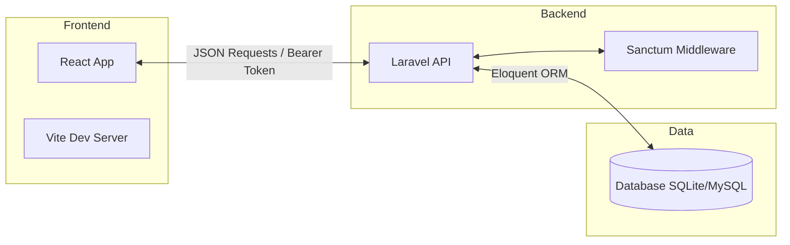

# Présentation du Projet : AutoExpertise

---

## Slide 1 : Page de Garde
**Plateforme de mise en relation Clients / Experts Automobiles**

- **Projet de Synthèse 2025 -- 2026**
- **Sujet :** Conception et Réalisation d'une plateforme web pour l'expertise automobile.
- **Réalisé par :** NAJJAI Fatima Zahra
- **Encadré par :** M. QACHCHACHI Nabil
- **Établissement :** IFMOTICA (Fès)
- **Filière :** Développement Digital (Groupe DD204)

---

## Slide 2 : Introduction & Contexte
### Contexte du Projet
- Croissance continue du parc automobile au Maroc.
- Augmentation de la demande en diagnostics et expertises (pré-achat, contrôle technique, sinistres).
- Nécessité de moderniser les services liés à l'automobile.

### Vision
- Digitaliser le processus de mise en relation.
- Offrir une interface moderne et intuitive pour tous les acteurs.

---

## Slide 3 : Problématique
### Les obstacles actuels
1. **Opacité du marché :** Difficulté de trouver un expert qualifié et disponible.
2. **Processus Informel :** Dépendance au bouche-à-oreille et au téléphone.
3. **Manque de Transparence :** Tarifs et compétences non affichés clairement.
4. **Gestion Complexe :** Absence d'outils de planification pour les professionnels.

---

## Slide 4 : La Solution : AutoExpertise
### Qu'est-ce qu'AutoExpertise ?
Une plateforme web centralisée, transparente et sécurisée qui fluidifie la réservation d'expertises automobiles.

### Valeurs Ajoutées
- **Rapidité :** Réservation en moins de 3 minutes.
- **Transparence :** Comparaison des profils et des tarifs.
- **Fiabilité :** Validation administrative obligatoire de chaque expert.
- **Efficacité :** Tableaux de bords dédiés pour chaque rôle.

---

## Slide 5 : Les Parties Prenantes (Acteurs)
### 1. Le Client
- Recherche des experts par ville et spécialité.
- Consulte les profils et les avis.
- Réserve et gère ses rendez-vous.

### 2. L'Expert Automobile
- Gère son profil professionnel (Bio, tarifs, diplômes).
- Définit ses créneaux de disponibilité.
- Accepte ou refuse les demandes de réservation.

### 3. L'Administrateur
- Supervise la plateforme.
- Modère les contenus.
- **Valide les inscriptions des experts** (Garant de la qualité).

---

## Slide 6 : Spécifications Fonctionnelles
### Modules Principaux
| Module | Fonctionnalités Clés |
| :--- | :--- |
| **Authentification** | Inscription multi-rôles, Protection des routes via Middleware. |
| **Espace Client** | Recherche filtrée, Réservation guidée, Historique des RDV. |
| **Espace Expert** | Planning dynamique, Gestion des demandes, Statistiques (KPIs). |
| **Administration** | Validation des experts, Modération des comptes. |

---

## Slide 7 : Besoins Non-Fonctionnels
- **Performance :** Temps de chargement initial < 2s.
- **Sécurité :** Authentification robuste (Laravel Sanctum), Protection CSRF/XSS.
- **Ergonomie :** Design **Dark Mode Premium** avec Glassmorphism.
- **Responsivité :** Accessibilité totale sur PC, Tablette et Mobile.
- **Maintenabilité :** Architecture découplée et code versionné (Git).

---

## Slide 8 : Stack Technologique
### "Modern & Scalable Architecture"

- **Frontend :**
  - React 19 (SPA)
  - Vite 7 (Build Tool)
  - Tailwind CSS 4 (Styling)
  - Lucide React (Iconographie)

- **Backend :**
  - Laravel 12 (API REST)
  - PHP 8.2+
  - Sanctum (Authentication)
  - SQLite / MySQL (Base de données)

---

## Slide 9 : Architecture du Système
### Architecture SPA + API REST

- Séparation nette entre l'interface utilisateur et la logique métier.
- Flexibilité pour des évolutions futures (Mobile App par exemple).

---

## Slide 10 : Conception de la Base de Données
### Modèle Conceptuel (MCD Simplifié)

- **Users :** Centralise tous les comptes (Rôles : client, expert, admin).
- **Expert Profiles :** Détails spécifiques aux professionnels (Spécialité, prix, bio).
- **Availabilities :** Créneaux horaires définis par les experts.
- **Appointments :** Lien entre un client, un expert et un créneau.

> [!TIP]
> L'intégrité des données est assurée par des clés étrangères et des contraintes d'unicité sur les références des rendez-vous.

---

## Slide 11 : Management de Projet
### Cycle de vie & Planification
- **Méthodologie :** Cycle en cascade adapté (Waterfall).
- **Durée totale :** 22 jours.

| Phase | Durée (Jours) | Livrables |
| :--- | :--- | :--- |
| **Analyse** | 3j | Cahier des charges, Étude de besoin |
| **Conception** | 4j | UML (Cas d'utilisation, Classes) |
| **Réalisation** | 10j | Backend Laravel + Frontend React |
| **Tests & Doc** | 5j | Validation, Rapport final, Présentation |

---

## Slide 12 : Design & Expérience Utilisateur (UI/UX)
### Identité Visuelle
- Thème principal : **Midnight Indigo** (Sleek Dark Mode).
- Esthétique : Effets de verre (Glassmorphism) et gradients subtils.
- **Micro-animations :** Transitions fluides entre les pages pour une sensation de "Premium App".

### Focus UX
- Navigation intuitive via Sidebar.
- Formulaires de réservation en étapes (Wizards).
- Feedback visuel immédiat lors des actions (Success/Error Toasts).

---

## Slide 13 : Conclusion & Perspectives
### Bilan
- Développement d'une plateforme complète répondant aux enjeux du secteur.
- Respect de la stack technologique moderne et performante.
- Validation des besoins par un système multi-acteurs fonctionnel.

### Perspectives d'Évolution
- Intégration de paiements en ligne (Stripe/CMI).
- Système de chat en temps réel entre experts et clients.
- Application mobile native (React Native) utilisant la même API.

---

# Merci de votre attention !
**Questions ?**
